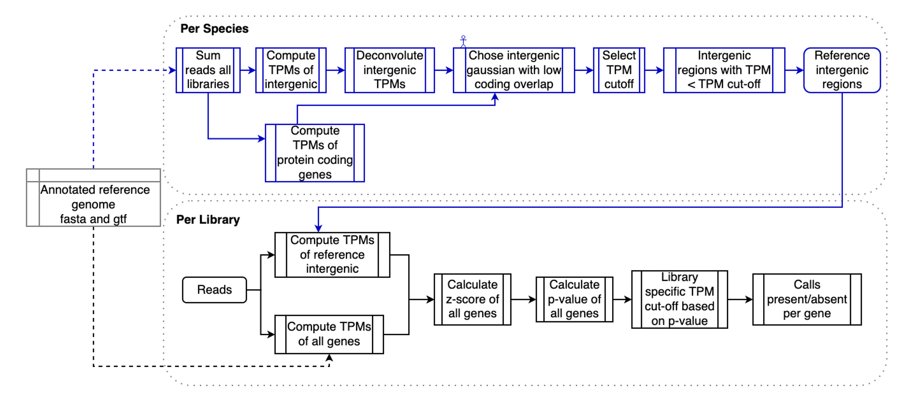

### **Robust inference of expression state in bulk and single-cell RNA-Seq using curated intergenic regions**

Sara S. Fonseca Costa, Marta Rosikiewic, Julien Roux, Julien Wollbrett, Frederic B. Bastian, Marc Robinson-Rechavi




The paper can be found on [bioRxiv]().

===============================================================================


*   [The repository organization](#repository)
    *   [data](#data)
    *   [scripts](#scripts)
    *   [figures](#figures)
    *   [stats_info](#stats_info)
    *   [analysis_info](#analysis_info)
    *   [complementary_analysis](#complementary_analysis)
*   [Run the repository](#runrepository)  
    *   [clone](#clone)
    *   [run per figure](#perfigure)
    *   [all analysis](#allanalysis)
*   [Container](#container)
    *   [pull the docker](#pull)
    *   [run it](#run)
*   [Raw data information](#raw)
    *   [access the information](#info)


<a name="repository"></a>The repository organization
-----------------------------------------------------

This repository collect all the data files, scripts  as well as intermediary files necessary to re-generate all the figures of the methods paper to call expressed genes on RNASeq data.

The repository is organized by 5 main folders (data, scripts, figures, stats_info and analysis_info). Each folder contain:

#### <a name="data"></a>[data/](data/)
Folder that contain all input data necessary to reproduce the figures of the paper as well as intermediary files that will be used later on the analysis. 

#### <a name="scripts"></a>[scripts/](scripts/)

Folder that contain all the scripts used to generate the figures and get the statistics information. This folder is organized based on sub-folder that contain the scripts used to generate a specific figure.

#### <a name="figures"></a>[figures/](figures/)

Folder that contain the sub-folders that correspond to a figure (or sub figures, this means for example figure 3A and 3B) in the paper.

#### <a name="stats_info"></a>[stats_info/](stats_info/)

Folder composed by sub-folders with .tsv files, that correspond to stats information of a figure or table in the paper.

#### <a name="analysis_info"></a>[analysis_info/](analysis_info/)

Folder that contain a .tsv file with the R version and packages version used during the analysis and during the generation of the figures.

##### An extra folder is provided with complementary information:

#### <a name="complementary_analysis"></a>[complementary_analysis/](complementary_analysis/)

Folder that contain data, scripts and files that are used as intermediary steps to generate main figures or to provide statistics mentioned during the manuscript.

<a name="runrepository"></a>Run the repository
-----------------------------------------------------
Please have in consideration that by doing that you may need to install some R packages or even to update your R version. All the packages used during this analysis as well as the R version are specified here [analysis_info/session_info.tsv](analysis_info//session_info.tsv)

#### <a name="clone"></a>clone
```
git clone https://github.com/BgeeDB/Methods_RNASeq_expression_calls.git
```

#### <a name="perfigure"></a>run per figure
If you want to inspect the input files and then regenerate the files associated with figure or the figure it self you can do that by typing:

```
Rscript $HOME/Methods_RNASeq_expression_calls/scripts/Figure_X/SCRIPT.R
```

#### <a name="allanalysis"></a>all analysis
If you want to regenerate all the files and figures of the paper you just need to call the main bash script:

```
bash $HOME/Methods_RNASeq_expression_calls/scripts/call_all_Rscripts.sh
```


<a name="container"></a>Container
-----------------------------------------------------

A container was build to regenerate all statistical files and figures without having version/installation problems, whether they are related to R or packages. 

#### <a name="pull"></a>pull the docker 

Pull the docker container
```
docker pull methods_rnaseq_expression_calls:0.1
```

#### <a name="run"></a>run it

First create a folder directory to export the results (figures or tsv files).
```
mkdir -p $HOME/docker_results/
```

Run the container in order to get a particular file or figure of the paper.
```
docker run --rm -it --mount type=bind,source=$HOME/docker_results/,target=/Copy_all_repository/figures/ --mount type=bind,source=$HOME/docker_results/,target=/Copy_all_repository/stats_info/ methods_rnaseq_expression_calls:0.1 Rscript /Copy_all_repository/scripts/Figure_9/barplot_panther_pathways.R
```

Run the container in order to get all files and figures from the analysis realized for the calls paper. Note that this process can take some time.

```
docker run --rm -it --mount type=bind,source=$HOME/docker_results/,target=/Copy_all_repository/figures/ --mount type=bind,source=$HOME/docker_results/,target=/Copy_all_repository/stats_info/ methods_rnaseq_expression_calls:0.1
```

After executing the command to run a particular R script or by running using be default, by calling the bash script call_all_Rscripts.sh, all figures and statistical files will be generated in `$HOME/docker_results/`.

If you want to work inside of the docker you just need to add `bash` to the end of the command above. Please note that once you go out of the container you will lose your analysis or modification that you have done inside of the container. 


<a name="raw"></a>Raw data 
-----------------------------------------------------

All the raw data (fastq.gz files) used on this paper are available on public databases with exception for GTEx data that can be retrieved using [BgeeDB R package](https://bioconductor.org/packages/release/bioc/html/BgeeDB.html) or through [bgee website](https://bgee.org/), but this data is already processed.

#### <a name="info"></a>access the information 

All the libraries as well as experiment IDs used on this work can be retrieved on the annotation files of the [Bgee pipeline](https://github.com/BgeeDB/bgee_pipeline/tree/develop). 
